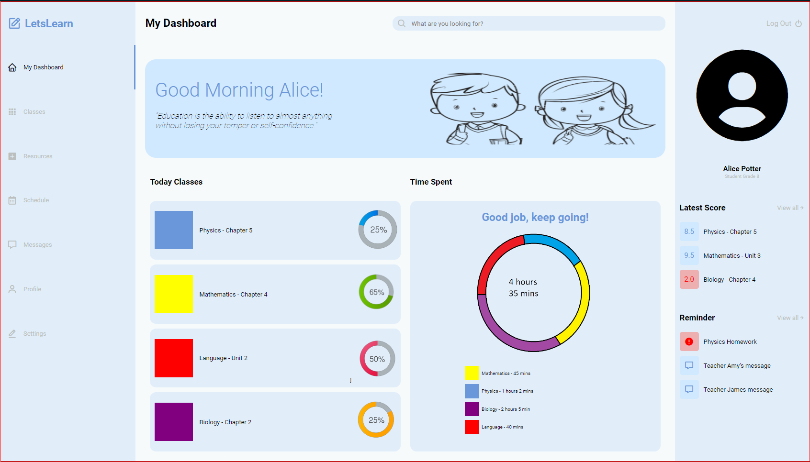

# ProvaTads2

Este projeto consiste em um dashboard desenvolvido como parte da avaliação do segundo semestre do curso de Analise e Desenvolvimento de Sistemas no IFMS Campi Três Lagoas.

## Objetivo

Este dashboard tem como principal objetivo aplicar de forma prática os conhecimentos adquiridos durante o segundo semestre do curso de Analise e Desenvolvimento de Sistemas. Construído como parte da avaliação prática, o projeto busca não apenas avaliar o domínio de HTML e CSS, mas também a capacidade de integrar e aplicar essas tecnologias para criar soluções funcionais e visualmente atraentes. Este dashboard serve como um meio de evidenciar a compreensão e aplicação efetiva dos tópicos abordados durante o curso.

## Telas

## Estrutura do Projeto

/
|-- index.html
|-- css/
| |-- style.css
| |-- style.css.map
| |-- style.scss
|-- img/
| |-- alunos.png
| |-- biologia.png
| |-- fisica.png
| |-- horas.png
| |-- linguagem.png
| |-- matematica.png
|-- README.md
|-- image.png

## Contato

Em caso de dúvidas ou sugestões, sinta-se à vontade para entrar em contato pelo e-mail raifernandes076@gmail.com ou via Instagram: @rai.fernandes\_.
